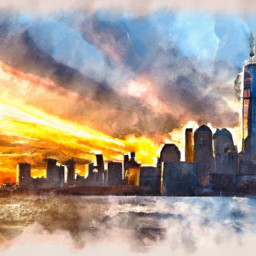
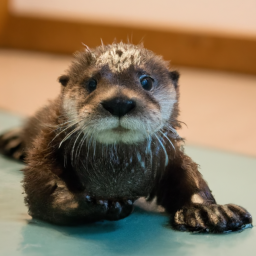
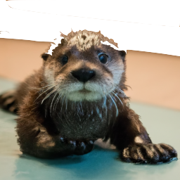
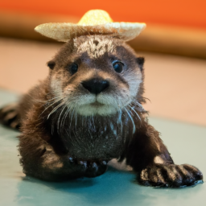
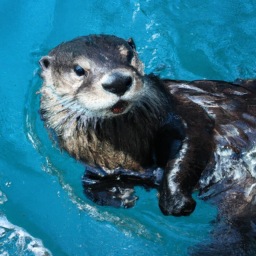
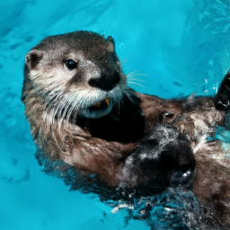

# go-dalle2 #


[](https://pkg.go.dev/github.com/Andrew-peng/go-dalle2/dalle2)


[](https://codecov.io/gh/Andrew-peng/go-dalle2)


Unofficial Dalle-2 API golang client library

## Setup ##

go-dalle2 is a simple client library, so with Go installed:

```bash
go get github.com/Andrew-peng/go-dalle2/dalle2
```

or

```go
import "github.com/Andrew-peng/go-dalle2/dalle2"
```

## Usage ##

For details about DALLE-2 (and api) visit the OpenAI documentation.

### Instantiate client ###

Instantiate the client with a valid OpenAI API key

```go
client, err := dalle2.MakeNewClientV1(apiKey)
if err != nil {
    log.Fatalf("Error initializing client: %s", err)
}
```

### Creating images ###

```go
resp, err := client.Create(
    context.Background(),
    "A skyline view of New York during the sunset, watercolor",
    dalle2.WithNumImages(1),
    dalle2.WithSize(dalle2.SMALL),
    dalle2.WithFormat(dalle2.URL),
)
if err != nil {
    log.Fatal(err)
}
for _, img := range resp.Data {
    fmt.Println("%s", img.Url)
}
```

| Prompt | Output |
| --- | --- |
| A skyline view of New York during the sunset, watercolor |  |

### Editing images ###

```go
imgBytes := ...
maskBytes := ...
resp, err := client.Edit(
    context.Background(),
    imgBytes,
    maskBytes,
    "A cute baby sea otter wearing a large sombrero",
    dalle2.WithNumImages(1),
    dalle2.WithSize(dalle2.SMALL),
    dalle2.WithFormat(dalle2.URL),
)
if err != nil {
    log.Fatal(err)
}
for _, img := range resp.Data {
    fmt.Println("%s", img.Url)
}
```

| Prompt | Image | Mask | Output |
| --- | --- | --- | --- |
| A cute baby sea otter wearing a large sombrero |  |  |  |

### Creating variations ###

```go
imgBytes := ...
resp, err := client.Edit(
    context.Background(),
    imgBytes,
    dalle2.WithNumImages(1),
    dalle2.WithSize(dalle2.SMALL),
    dalle2.WithFormat(dalle2.URL),
)
if err != nil {
    log.Fatal(err)
}
for _, img := range resp.Data {
    fmt.Println("%s", img.Url)
}
```

| Image | Output |
| --- | --- |
|  |  |

## License ##

go-dalle2 is distributed under the MIT-style license found in the [LICENSE](./LICENSE)
file.
